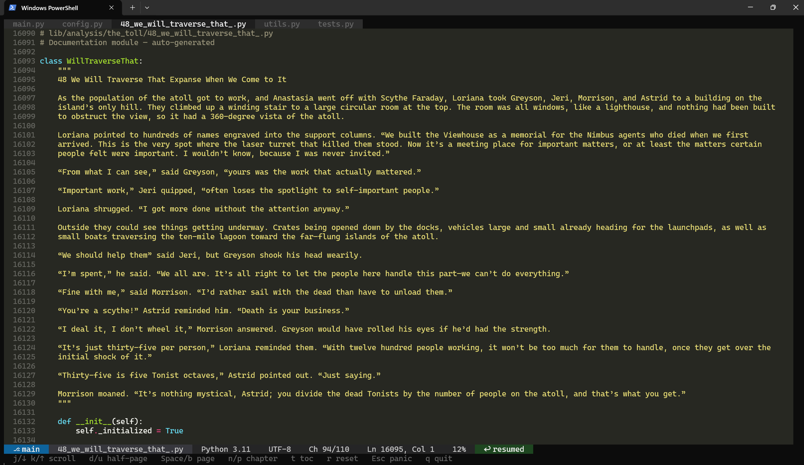
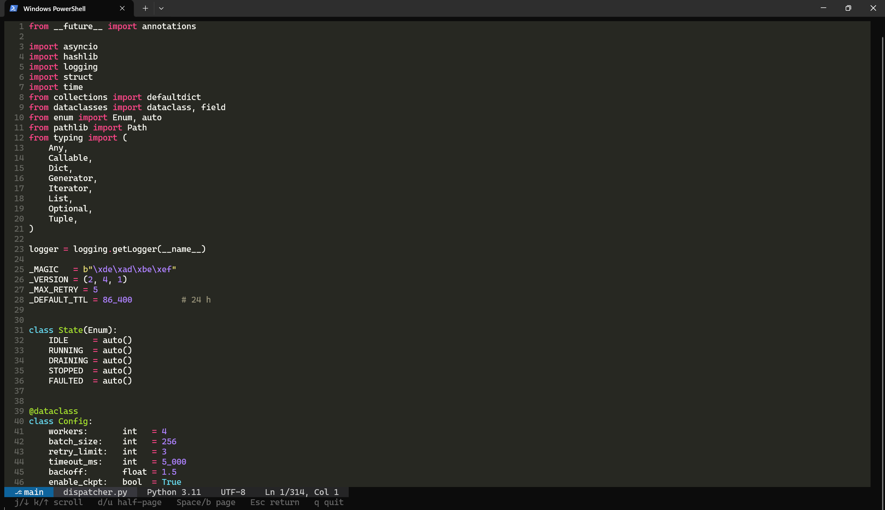
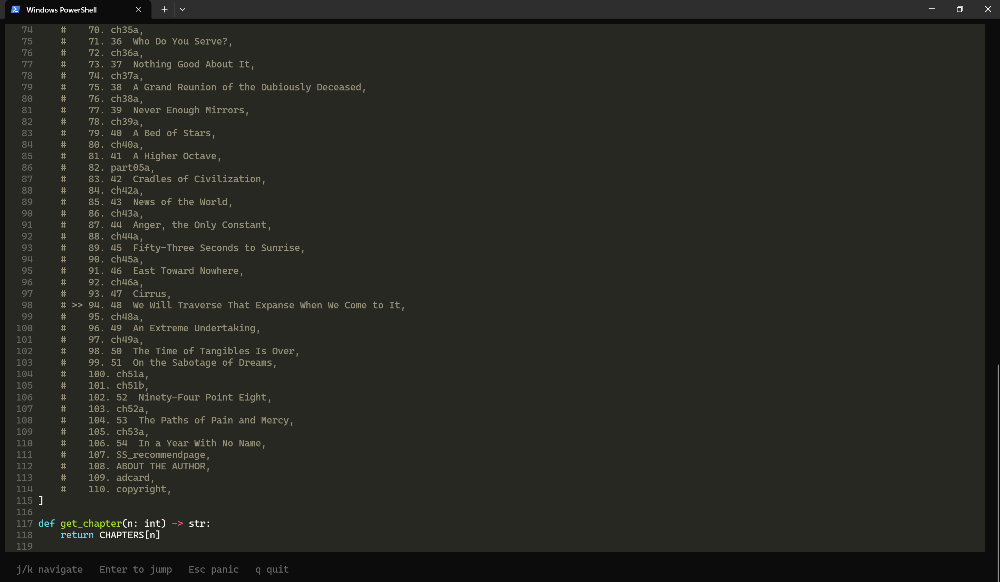

# epub_cli_reader
Read EPUB files in the terminal, disguised as syntax-highlighted Python code.

## Screenshots

### Reading view
<!-- Add screenshot: python reader.py book.epub -->


### Panic mode
<!-- Add screenshot: press Esc while reading -->


### Table of contents
<!-- Add screenshot: press t while reading -->


## Setup
```
pip install -r requirements.txt
```

## Usage
```
python reader.py book.epub
python reader.py book.epub --chapter 3
```

## Keys

### Reader
| Key | Action |
|-----|--------|
| `j` / `↓` | Scroll down one line |
| `k` / `↑` | Scroll up one line |
| `d` / `u` | Half-page down / up |
| `Space` / `b` | Full page down / up |
| `n` / `p` | Next / previous chapter |
| `g` / `G` | Top / bottom of chapter |
| `t` | Table of contents |
| `r` | Reset saved position |
| `Esc` | Toggle panic mode |
| `q` | Quit |

### Panic mode
| Key | Action |
|-----|--------|
| `j` / `↓` `k` / `↑` | Scroll |
| `d` / `u` | Half-page down / up |
| `Space` / `b` | Full page down / up |
| `g` / `G` | Top / bottom |
| `Esc` | Return to book |
| `q` | Quit |
